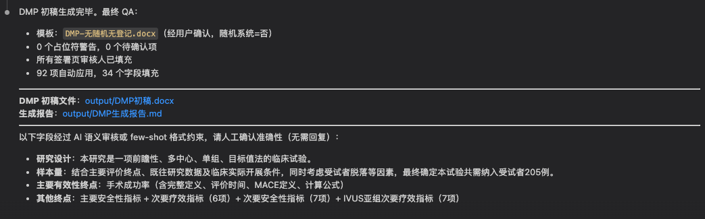

# 版本更新日志

## 2026-05-26

- **AI 自动 QC 与二次确认**：增加对协议与 DM 日志冲突、DM 日志内部逻辑冲突的检查，并在需要时向用户二次确认。示例包括：协议可判断为药物项目但 DM 日志为器械项目；协议为单组研究但 DM 日志中随机系统为“是”；外部数据字段为“否”但外部数据类型非空。

- **人工确认提问方式**：对于 AI 判断模糊、需要用户确认的问题，不再提前中断；改为最后统一进入确认阶段，避免第一轮未抓到但二次抓取已解决的问题被误问。为了配合 UI，最终确认时一条一条弹出。

- **AI 润色/约束提示**：最终 agent 回复中增加提示，列出经过 AI 语义审核或 few-shot 格式约束的字段，提醒用户人工确认准确性，但无需用户回复。

- **签署页审核人自动填写**：不同职能的审核人支持从 DM 日志自动填写；模板中的审核人占位符已调整为 `审核人：key 1~4`。

- **模板问题修复**：修复 PDC 模板错乱相关问题，并对三个 DMP 模板进行更新校验。

- **无关字段清理**：移除一个与 DMP 输出无关的 DM 日志日期字段。

- **验证结果**：当前完整单元测试通过，共 13 个测试。
